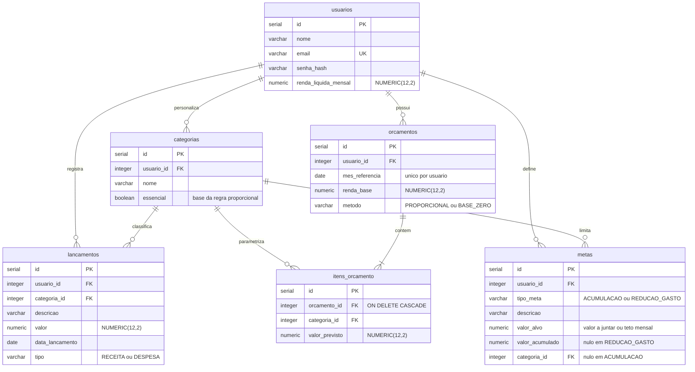

# VGRFinance
## AEP 1ª Entrega

**Instituição:** Unicesumar

**Equipe:** Guilherme Friedrich da Silva (RA 25000902-2), Rafael Alcantara Santos (RA 25000917-2), Vitor Gabriel Oliveira Ventania (RA 25141604-2)

**Curso:** Engenharia de Software - Noturno - Turma A

---

# 1. O Problema e os Requisitos (Escopo)

## 1.1 O problema e a ODS
 
Manuela recebe o salário todo dia 5. Nos dias seguintes, paga as contas fixas (aluguel, internet e a fatura do cartão), e o que sobra precisa durar até o fim do mês. Ela não anota nada. Sabe mais ou menos se o mês está apertado ou tranquilo, mas não saberia dizer o motivo.
 
A renda dela dá para pagar o mês. O problema está na forma como esse dinheiro é usado. Na hora de gastar, Manuela não separa o que é essencial (moradia, transporte, alimentação) do que é supérfluo (assinaturas, delivery, compras por impulso), e só percebe a mistura quando confere o saldo e ele já acabou. Ela também não define no começo do mês quanto vai guardar: a poupança fica para o final, com o que sobrar, quando sobra.
 
Depois de doze meses assim, ela não tem reserva de emergência. Se o carro quebra ou a geladeira pifa, o conserto vai para o cartão, parcelado. Os juros dessas parcelas levam uma parte da renda do mês seguinte, que já estava apertado. Vira um ciclo: sem folga no orçamento ela não consegue formar uma reserva, e sem reserva cada imprevisto consome a folga que poderia existir.
 
Manuela já testou alguns aplicativos de finanças. Todos registram e classificam os gastos, e alguns mostram gráficos do histórico. Mas nenhum deles diz quanto ela deveria reservar para cada categoria antes de o salário entrar, nem explica o que aquele gráfico significa para as decisões do mês. Também não relacionam o gasto do dia a um objetivo concreto, como montar a reserva de emergência, fazer uma viagem ou juntar a entrada de um financiamento. Informação sobre o que já aconteceu ela tem de sobra; o que falta é orientação sobre o que fazer agora.
 
O projeto se alinha à ODS 1 (Erradicação da Pobreza), especificamente à meta 1.4, que trata do acesso a serviços financeiros, e à ODS 4 (Educação de Qualidade), por ter caráter formativo.
 
A fragilidade financeira não se explica só pela renda baixa. Uma parte vem da falta de método: a maioria das pessoas nunca aprendeu formalmente a montar um orçamento, calcular quanto consegue poupar ou controlar gastos por categoria. A proposta do sistema é aplicar métodos de orçamento já conhecidos aos dados reais do usuário e explicar o que cada indicador significa. Assim, o conteúdo de educação financeira, que costuma ser genérico, passa a responder ao caso concreto de quem está usando.

 
## 1.2 Requisitos Funcionais
 
**RF01** — O sistema deve permitir o cadastro, a consulta, a alteração e a exclusão de lançamentos financeiros, contendo descrição, valor, data, tipo (receita ou despesa) e categoria associada.
 
**RF02** — O sistema deve permitir o cadastro, a consulta, a alteração e a exclusão de categorias de despesa próprias do usuário, indicando se cada categoria é essencial ou não essencial.
 
**RF03** — O sistema deve permitir a criação de um orçamento mensal a partir da renda líquida informada, com escolha do método de distribuição entre a regra proporcional (padrão 50/30/20) e a regra base zero, gerando os valores previstos por categoria.
 
**RF04** — O sistema deve permitir a edição dos valores previstos de cada item do orçamento gerado, de modo que a distribuição sugerida pelo método funcione como ponto de partida ajustável pelo usuário.
 
**RF05** — O sistema deve permitir a consulta comparativa entre o orçamento planejado e os gastos lançados no período, apresentando, por categoria, o valor previsto, o valor realizado, o desvio e a sinalização das categorias em que o limite foi ultrapassado.
 
**RF06** — O sistema deve permitir o cadastro e o acompanhamento de metas financeiras de acumulação, com um valor-alvo a juntar, e de redução de gasto, com um teto mensal para uma categoria, apresentando o progresso de cada meta.
 
**RF07** — O sistema deve permitir a geração de um diagnóstico financeiro educativo, calculando a taxa de poupança, a aderência ao orçamento e o peso das despesas essenciais sobre a renda, e apresentando, para cada indicador, a faixa em que o usuário se encontra e a explicação do seu significado.
---

# 2. O Planejamento (Cronograma / Backlog)

| Sprint / Data | Épico | Atividade / Story | Responsável |
|---|---|---|---|
| Sprint 1 18/09 – 10/10 | Categorias e Lançamentos | COMO UM usuário EU QUERO cadastrar minhas categorias e registrar receitas e despesas PARA QUE eu enxergue para onde meu dinheiro está indo. | Vitor Gabriel Oliveira Ventania |
| Sprint 2 11/10 – 24/10 | Motor de Orçamento | COMO UM usuário EU QUERO escolher um método e receber uma distribuição sugerida da minha renda PARA QUE eu não precise adivinhar quanto destinar a cada categoria. | Vitor Gabriel Oliveira Ventania |
| Sprint 3 25/10 – 03/11 | Acompanhamento | COMO UM usuário EU QUERO comparar o previsto com o realizado e ser avisado dos estouros PARA QUE eu corrija o rumo antes do fim do mês. | Rafael Alcantara Santos |
| Sprint 4 04/11 – 13/11 | Metas e Diagnóstico | COMO UM usuário EU QUERO definir metas e entender o que meus indicadores significam PARA QUE eu aprenda a tomar decisões financeiras melhores. | Guilherme Friedrich da Silva |

---

# 3. A Justificativa Técnica e Visual
 
## 3.1 Linguagem de programação
 
Escolhemos Java porque a aplicação lida diretamente com dinheiro, e cálculo financeiro exige cuidado. O sistema vai distribuir a renda entre categorias, comparar o orçamento com os gastos e acompanhar metas, e todas essas contas precisam fechar certo. Para isso, o Java oferece a classe BigDecimal, que trabalha com valores decimais sem os erros de arredondamento dos tipos double e float. Sem ela, o orçamento poderia mostrar valores diferentes dos esperados.
 
A orientação a objetos também combina com o projeto. Teremos mais de um método de orçamento e mais de um tipo de meta, e com interfaces, herança e polimorfismo cada regra fica na sua própria classe, em vez de um código cheio de if e else. A tipagem estática ajuda a pegar erros ainda durante o desenvolvimento, o que pesa bastante num sistema em que um erro pequeno de cálculo muda o número que o usuário vê.
 
## 3.2 Banco de dados
 
Escolhemos o PostgreSQL porque os dados da aplicação são muito ligados entre si. Cada usuário tem seus orçamentos, cada orçamento tem itens por categoria, as categorias agrupam os lançamentos e as metas dependem da evolução desses dados. Um banco relacional organiza bem esse tipo de estrutura, e o PostgreSQL permite definir chaves estrangeiras e restrições que impedem registros inconsistentes, como um lançamento apontando para uma categoria que não existe.
 
Para os valores em dinheiro, usamos o tipo NUMERIC, que guarda decimais com precisão exata. É o equivalente, no banco, ao BigDecimal do Java: o valor calculado no back-end é salvo sem perder casas decimais.
 
Como a proposta é educativa, o histórico também importa. Com os dados dos meses anteriores guardados, a aplicação consegue mostrar ao usuário quanto ele gastou e também como seus hábitos e seu planejamento mudaram ao longo do tempo.
 
## 3.3 Padrão arquitetural
 
Separamos o sistema em back-end em Java e front-end em React para dividir bem as responsabilidades. O Java cuida do núcleo da aplicação, que são os cálculos e as regras financeiras. O React cuida do que o usuário vê e de como ele interage com o sistema.
 
Essa divisão é importante para a proposta porque o usuário precisa entender os números, e não só recebê-los. Em vez de mostrar apenas que alguém gastou R$ 800 em uma categoria, a interface pode mostrar quanto isso representa do orçamento, com gráficos e uma explicação curta do que o valor significa.
 
O React também atualiza a tela conforme os dados mudam. Quando o usuário ajusta o orçamento ou registra um gasto novo, a interface mostra a mudança sem recarregar a página inteira.
 
A comunicação entre as duas partes é feita por uma API REST: o React pede as informações, o Java aplica as regras e faz os cálculos, e o PostgreSQL armazena os dados. Com cada camada cuidando de uma coisa, fica mais fácil organizar o projeto e fazer alterações depois.
---

# 4. Diagramas e GitHub Estruturado

## 4.1 Repositório

Repositório público no GitHub: https://github.com/Alcantara-Rafa/VGRFinance

Estrutura de diretórios criada: `/src`, `/docs`, `/database`.

## 4.2 Diagrama de Classes (UML)

**Herança** — Meta é uma classe abstrata, base de MetaAcumulacao e MetaReducaoGasto. Cada tipo de meta calcula o progresso de um jeito. Na meta de acumulação, o sistema compara o valor já juntado com o valor desejado. Na meta de redução de gasto, compara o que foi gasto no mês com o limite definido para a categoria.
 
**Composição** — Orcamento é composto por ItemOrcamento: os itens só existem dentro de um orçamento e não fazem sentido sozinhos. Todo orçamento tem pelo menos um item. Já Categoria continua existindo mesmo que um lançamento, orçamento ou meta ligado a ela seja excluído, e por isso essa relação foi representada como agregação.
 
**Polimorfismo** — O método distribuir(), definido na interface MetodoOrcamentario, tem uma implementação em RegraProporcional e outra em RegraBaseZero. Com isso, dá para trocar a forma de distribuir a renda sem mexer na classe Orcamento. É o padrão de projeto Strategy: cada regra de distribuição fica em uma classe própria e pode ser usada de forma independente.
 
A mesma ideia vale para a hierarquia de Meta, com os métodos calcularProgresso() e getSituacao(). A aplicação trata todas as metas do mesmo jeito, mesmo que cada tipo faça seus cálculos de forma diferente por dentro.
 
A classe Diagnostico não é salva no banco de dados. Os indicadores são calculados na hora, a partir dos lançamentos, do orçamento e da renda do usuário.
---

## 4.3 Diagrama do Banco de Dados (DER)

**usuarios** — Guarda os dados do usuário e sua renda líquida mensal, que serve de ponto de partida para montar e distribuir o orçamento.
 
**categorias** — Guarda as categorias de despesa criadas pelo usuário. Elas organizam os lançamentos, os itens do orçamento e as metas, e indicam se o gasto é essencial ou não, informação usada pelas regras de planejamento.
 
**lancamentos** — Registra as movimentações financeiras do usuário, receitas e despesas, cada uma ligada à sua categoria. É a tabela por trás do cadastro, da consulta, da alteração e da exclusão de lançamentos.
 
**orcamentos** — Representa o orçamento de um mês. Uma restrição de unicidade entre usuario_id e mes_referencia garante que cada usuário tenha no máximo um orçamento por mês. A coluna metodo registra qual regra gerou a distribuição inicial.
 
**itens_orcamento** — Guarda o valor planejado para cada categoria dentro de um orçamento, que o usuário pode alterar depois da distribuição inicial. O valor realizado não fica nessa tabela, porque pode ser calculado a partir dos lançamentos; assim, a mesma informação não fica guardada em dois lugares.
 
A chave estrangeira entre itens_orcamento e orcamentos usa ON DELETE CASCADE: quando um orçamento é excluído, os itens dele são removidos junto, e o banco não fica com itens soltos.
 
**metas** — Guarda as metas financeiras do usuário. A coluna tipo_meta indica o tipo da meta e é a forma de representar, no banco, a herança que existe no diagrama de classes. O campo valor_alvo é o valor a ser acumulado, nas metas de acumulação, ou o limite de gasto, nas metas de redução.
 
O diagnóstico do RF07 não tem tabela própria. Os indicadores são calculados a partir dos dados de lancamentos, orcamentos e usuarios, então o diagnóstico sempre reflete a situação atual, sem o risco de um valor salvo ficar desatualizado.
