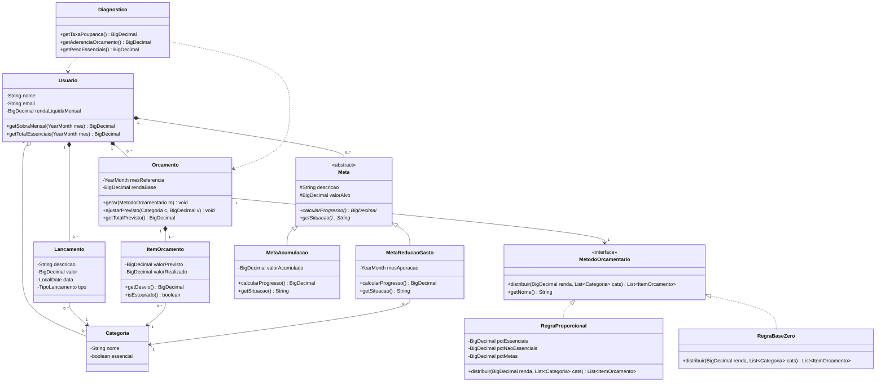
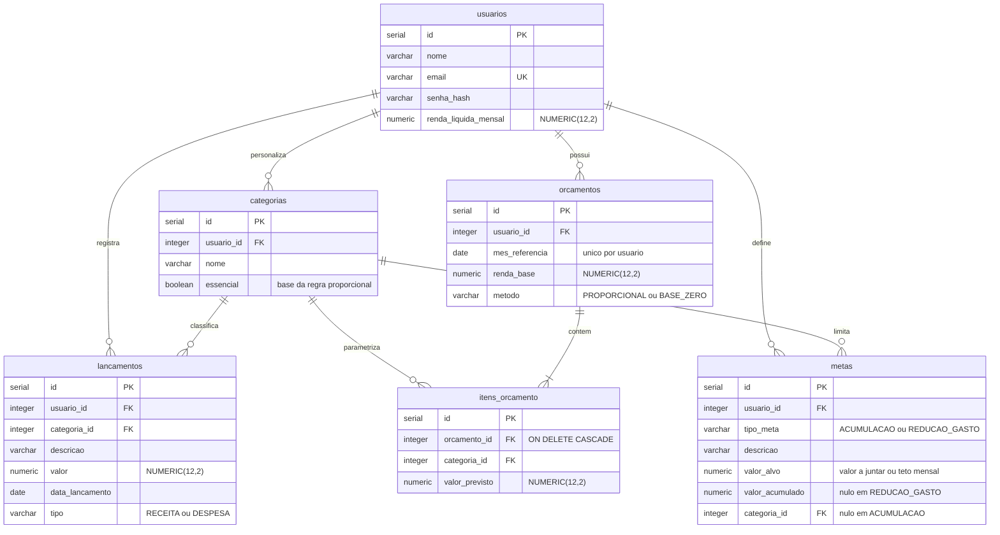

# VGRFinance
## AEP 1ª Entrega

**Instituição:** Unicesumar

**Equipe:** Guilherme Friedrich da Silva (RA 25000902-2), Rafael Alcantara Santos (RA 25000917-2), Vitor Gabriel Oliveira Ventania (RA 25141604-2)

**Curso:** Engenharia de Software - Noturno - Turma A

---

# 1. O Problema e os Requisitos (Escopo)

## 1.1 O problema e a ODS

Manuela é assalariada e recebe todo dia 5. Nos dias seguintes paga as contas fixas: aluguel, internet, cartão. O que sobra depois disso é o que ela tem para o resto do mês. Ela não anota nada. Sabe de cabeça se o mês está apertado ou tranquilo, mas não consegue explicar por quê.

A renda dela dá para o mês. O problema está em como ela usa essa renda. Antes de gastar, Manuela não separa o que é essencial, como moradia, transporte e alimentação, do que é supérfluo, como assinaturas, delivery e compras por impulso. Ela só percebe a mistura quando olha o saldo e ele já foi embora. Também não decide no começo do mês quanto vai guardar. A poupança fica por último, com o que sobrar, se sobrar.

O resultado aparece ao fim de doze meses: Manuela não tem reserva de emergência. Quando o carro quebra ou a geladeira para de funcionar, o conserto vira parcela no cartão. Os juros dessa parcela comem uma fatia da renda do mês seguinte, que já era apertada. Cada imprevisto sem reserva empurra o mês seguinte para o mesmo aperto, e a falta de poupança de um mês explica por que não houve folga no outro.

Manuela já testou aplicativos de finanças. Todos registram e categorizam o que ela gastou, e alguns geram gráficos do histórico. Nenhum diz quanto ela deveria destinar a cada categoria antes de o salário cair. Nenhum explica o que aquele gráfico significa para a decisão daquele mês. E nenhum liga o gasto de hoje a um objetivo concreto, seja a reserva de emergência, uma viagem ou a entrada de um financiamento. Ela tem informação de sobra sobre o passado. Falta orientação sobre o que fazer agora.

O projeto se alinha à **ODS 1 (Erradicação da Pobreza)**, meta 1.4, que trata de acesso a serviços financeiros, e à **ODS 4 (Educação de Qualidade)**, pelo caráter formativo da solução.

Renda insuficiente explica parte da fragilidade financeira. A outra parte é falta de método. A maior parte das pessoas nunca teve contato formal com orçamento, taxa de poupança ou controle de gastos por categoria. O sistema aplica métodos orçamentários já consagrados sobre os dados reais do usuário e explica o que cada indicador gerado significa, transformando conteúdo genérico de educação financeira em orientação para o caso concreto de quem está usando.

## 1.2 Requisitos Funcionais

**RF01** — O sistema deve permitir o cadastro, a consulta, a alteração e a exclusão de lançamentos financeiros, contendo descrição, valor, data, tipo (receita ou despesa) e categoria associada.

**RF02** — O sistema deve permitir o cadastro, a consulta, a alteração e a exclusão de categorias de despesa próprias do usuário, com indicação de a categoria ser essencial ou não essencial.

**RF03** — O sistema deve permitir a criação de um orçamento mensal a partir da renda líquida informada, com escolha do método de distribuição entre a regra proporcional (padrão 50/30/20) e a regra base zero, gerando os valores previstos por categoria.

**RF04** — O sistema deve permitir a edição dos valores previstos de cada item do orçamento gerado, de forma que a distribuição sugerida pelo método seja um ponto de partida ajustável pelo usuário.

**RF05** — O sistema deve permitir a consulta comparativa entre o orçamento planejado e os gastos efetivamente lançados no período, apresentando por categoria o valor previsto, o valor realizado, o desvio apurado e a sinalização das categorias em que o limite foi ultrapassado.

**RF06** — O sistema deve permitir o cadastro e o acompanhamento de metas financeiras de acumulação, com valor a ser juntado, e de redução de gasto, com teto mensal para uma categoria, apresentando para cada meta o progresso apurado.

**RF07** — O sistema deve permitir a geração de um diagnóstico financeiro educativo, calculando a taxa de poupança, a aderência ao orçamento e o peso das despesas essenciais sobre a renda, apresentando para cada indicador a faixa em que o usuário se encontra e a explicação do seu significado.

---

# 2. O Planejamento (Cronograma / Backlog)

| Sprint / Data | Épico | Atividade / Story | Responsável |
|---|---|---|---|
| Sprint 1 18/09 – 10/10 | Categorias e Lançamentos | COMO UM usuário EU QUERO cadastrar minhas categorias e registrar receitas e despesas PARA QUE eu enxergue para onde meu dinheiro está indo. | Vitor Gabriel Oliveira Ventania |
| Sprint 2 11/10 – 24/10 | Motor de Orçamento | COMO UM usuário EU QUERO escolher um método e receber uma distribuição sugerida da minha renda PARA QUE eu não precise adivinhar quanto destinar a cada categoria. | Vitor Gabriel Oliveira Ventania |
| Sprint 3 25/10 – 03/11 | Acompanhamento | COMO UM usuário EU QUERO comparar o previsto com o realizado e ser avisado dos estouros PARA QUE eu corrija o rumo antes do fim do mês. | Rafael Alcantara Santos |
| Sprint 4 04/11 – 13/11 | Metas e Diagnóstico | COMO UM usuário EU QUERO definir metas e entender o que meus indicadores significam PARA QUE eu aprenda a tomar decisões financeiras melhores. | Guilherme Friedrich da Silva |

---

# 3. A Justificativa Técnica e Visual

## 3.1 Linguagem de programação: Java

**Precisão aritmética.** Todo o escopo é monetário e envolve operações decimais repetidas: distribuir a renda entre categorias (RF03), apurar desvios (RF05) e calcular indicadores percentuais (RF07). Os tipos `double` e `float` guardam decimais como aproximações em base binária, e o erro se acumula a cada conta. Em um teste com 20 mil orçamentos simulados usando ponto flutuante, mais da metade não fechou: a soma dos itens divergiu da renda informada, às vezes por frações invisíveis na tela, às vezes por um centavo inteiro. Java oferece a classe `java.math.BigDecimal`, que faz aritmética decimal exata e permite definir escala e modo de arredondamento, incluindo o `RoundingMode.HALF_EVEN` usado no meio bancário. Como a regra base zero do RF03 exige que a soma dos valores previstos seja exatamente igual à renda, precisão decimal é condição para o sistema funcionar.

**Suporte aos pilares de POO.** Dois pontos do escopo têm variação real de comportamento. Os métodos orçamentários do RF03 distribuem a mesma renda de formas diferentes, e os dois tipos de meta do RF06 calculam progresso por fórmulas distintas. Com interface e classe abstrata, essa variação vira polimorfismo. Sem elas, viraria uma sequência de condicionais sobre um campo de tipo.

**Tipagem estática.** Erro em regra financeira não aparece na tela. Um valor errado tem a mesma cara de um valor certo. A verificação em tempo de compilação reduz a chance de esse tipo de erro passar despercebido.

## 3.2 Banco de dados: PostgreSQL

**Tipo `NUMERIC` com precisão e escala definidas.** É o equivalente do `BigDecimal` no banco. Guardar valores monetários em `NUMERIC(12,2)` e percentuais em `NUMERIC(5,4)` mantém a precisão que o cálculo produziu. Se esses campos fossem `FLOAT` ou `REAL`, o erro que o `BigDecimal` evitou entraria de volta na hora de gravar.

**Integridade referencial.** As relações entre usuário, categorias, lançamentos, orçamentos e metas precisam de chaves estrangeiras com exclusão em cascata. Apagar um orçamento tem que apagar os itens dele, que não existem sozinhos. O PostgreSQL garante isso no próprio esquema, sem depender de a aplicação lembrar de fazer a limpeza.

## 3.3 Padrão arquitetural: API REST com front-end desacoplado

A solução terá um back-end em Java expondo uma API REST e um front-end construído com React.

**Separação entre back-end e front-end.** As regras que sustentam o escopo ficam no servidor: distribuição da renda, validação de que a soma dos previstos não passa da renda, apuração de desvios e cálculo dos indicadores. A camada de apresentação envia dados e exibe resultados, sem repetir nenhuma dessas regras. Isso também mantém todo cálculo monetário do lado Java, onde está o `BigDecimal`. Se parte da aritmética rodasse no navegador, cairia em ponto flutuante e o argumento da seção 3.1 se perderia.

**React na camada de apresentação.** O React monta a tela a partir de componentes que reagem a eventos. Quando o usuário mexe em um campo, apenas a parte afetada da interface é recalculada e redesenhada, sem recarregar a página. Isso atende ao RF04, em que o valor previsto de cada categoria é editado e o total disponível precisa se atualizar na mesma hora, e ao RF05, em que as categorias estouradas são sinalizadas conforme os lançamentos entram.

O ecossistema do React também oferece bibliotecas maduras de componentes e de gráficos. Isso permite apresentar os indicadores do RF07 de forma legível e entregar uma interface com acabamento profissional sem que a equipe precise construir cada elemento visual do zero, mantendo o esforço concentrado no back-end.

---

# 4. Diagramas e GitHub Estruturado

## 4.1 Repositório

Repositório público no GitHub: https://github.com/Alcantara-Rafa/VGRFinance

Estrutura de diretórios criada: `/src`, `/docs`, `/database`.

## 4.2 Diagrama de Classes (UML)

**Herança.** `Meta` é classe abstrata e dá origem a `MetaAcumulacao` e `MetaReducaoGasto`. As duas calculam progresso de formas diferentes: a primeira divide o valor acumulado pelo valor alvo; a segunda compara o gasto do mês na categoria com o teto definido, apurando economia ou excedente.

**Composição 1:N.** `Orcamento` é composto por instâncias de `ItemOrcamento`. Um item não existe fora do orçamento que o gerou, e a multiplicidade mínima `1..*` registra que não há orçamento sem itens. Já a relação entre `Usuario` e `Categoria` é uma agregação: a categoria é usada por lançamentos, itens de orçamento e metas, e continua existindo quando qualquer um deles é apagado.

**Polimorfismo.** O método `distribuir()` é implementado com `@Override` por `RegraProporcional` e `RegraBaseZero`. Trocar a regra muda toda a alocação da renda sem alterar uma linha da classe `Orcamento`. Esse arranjo é o padrão de projeto Strategy: o algoritmo fica encapsulado em classes intercambiáveis que são injetadas em quem as consome. Os percentuais da regra proporcional são atributos da instância, então outras configurações não exigem classes novas. Na hierarquia de `Meta`, `calcularProgresso()` e `getSituacao()` também são sobrescritos, o que permite tratar metas com matemática interna diferente pela mesma interface de acompanhamento.

`Diagnostico` não é entidade persistida. Seus indicadores são calculados a partir dos lançamentos, do orçamento e da renda do usuário.

## 4.3 Diagrama do Banco de Dados (DER)

**`usuarios`** — dados de acesso e renda líquida mensal, que é o valor de entrada de toda distribuição orçamentária.

**`categorias`** — categorias de despesa criadas pelo próprio usuário (RF02). A coluna `essencial` é o que permite à regra proporcional separar necessidades de desejos.

**`lancamentos`** — entidade principal das operações de CRUD (RF01). Guarda receitas e despesas classificadas por categoria.

**`orcamentos`** — orçamento de um mês de referência. O par `usuario_id` e `mes_referencia` tem restrição de unicidade, de modo que existe no máximo um orçamento por mês. A coluna `metodo` registra qual regra gerou a distribuição inicial.

**`itens_orcamento`** — valores previstos por categoria, que o usuário pode editar depois da geração automática (RF04). Não há coluna de valor realizado: ele é somado a partir de `lancamentos` no momento da consulta, o que evita guardar a mesma informação em dois lugares. A chave estrangeira `orcamento_id` usa `ON DELETE CASCADE`, que é a composição do diagrama de classes aplicada ao banco.

**`metas`** — metas do usuário (RF06). A coluna `tipo_meta` discrimina a hierarquia de herança. A coluna `valor_alvo` guarda o valor a acumular nas metas de acumulação e o teto mensal nas metas de redução de gasto.

O diagnóstico do RF07 não tem tabela própria. Ele é calculado na consulta a partir de `lancamentos`, `orcamentos` e `usuarios`, o que evita um indicador armazenado divergir da situação real do usuário.
