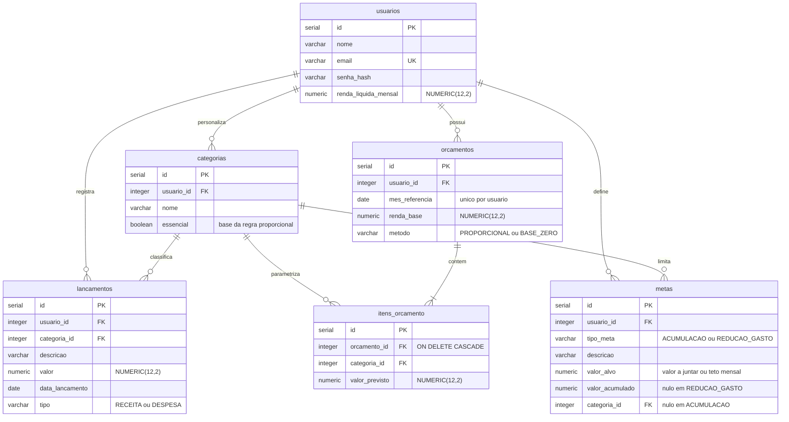

# VGRFinance
##  AEP 1ª Entrega

**Instituição:** Unicesumar
**Equipe:** Guilherme Friedrich da Silva RA:25000902-2, Rafael Alcantara Santos RA:25000917-2, Vitor Gabriel Oliveira Ventania RA:25141604-2
**Curso:** Engenharia de Software 

---

# 1. O Problema e os Requisitos (Escopo)

## 1.1 O problema e a ODS

Maria é assalariada, recebe seu salário todo dia 5 e paga as contas fixas nos dias seguintes — aluguel, internet, cartão. Sobra o que sobra, e é isso que ela usa até o fim do mês. Ela não tem uma planilha, não tem um aplicativo que abre todo dia; sabe, de cabeça, que "está apertado" ou "está tranquilo", mas não sabe dizer por quê.

O problema não é a renda, é o comportamento: Maria não separa o que é essencial (moradia, transporte, alimentação) do que é supérfluo (assinaturas, delivery, compras por impulso) antes de gastar — ela só percebe a mistura quando o saldo já foi consumido. Também não define, no início do mês, quanto vai poupar; a poupança é tratada como resíduo — o que sobrar, se sobrar — e não como uma meta fixada antes dos outros gastos.

A consequência é mensurável e recorrente: ao fim de doze meses, Maria não tem reserva de emergência. Quando o carro quebra ou a geladeira para de funcionar, o imprevisto vira parcelamento no cartão, com juros que comem uma fatia ainda maior da renda do mês seguinte. O problema se realimenta — cada imprevisto não coberto por reserva empurra o próximo mês para o mesmo ciclo de aperto, e a ausência de poupança de um mês vira o motivo pelo qual não há gordura para o mês seguinte.

Os aplicativos de finanças que Maria já tentou usar resolvem metade do problema: eles registram e categorizam o que já foi gasto, geram gráficos bonitos do passado. Mas nenhum deles diz a ela, antes do dinheiro cair na conta, quanto deveria ir para cada categoria; nenhum explica o que aquele gráfico significa para a decisão dela naquele mês; e nenhum liga o comportamento de gastar de hoje a um objetivo concreto (a reserva de emergência, uma viagem, uma entrada de financiamento). São ferramentas de registro, não de decisão — e a dor de Maria não é falta de dados sobre o passado, é falta de orientação sobre o futuro.

O projeto alinha-se à **ODS 1 (Erradicação da Pobreza)**, meta 1.4, que trata de acesso a serviços financeiros, e à **ODS 4 (Educação de Qualidade)**, pelo caráter formativo da solução.

A fragilidade financeira não decorre apenas de renda insuficiente, mas de ausência de método. A maior parte das pessoas nunca teve contato formal com orçamento, taxa de poupança ou controle de gastos por categoria. Ao aplicar métodos orçamentários reconhecidos sobre os dados reais do usuário e explicar o significado de cada indicador gerado, o sistema converte educação financeira abstrata em orientação concreta e personalizada.

## 1.2 Requisitos Funcionais

A entidade principal das operações de CRUD é `Lancamento`.

**RF01** — O sistema deve permitir o cadastro, a consulta, a alteração e a exclusão de lançamentos financeiros, contendo descrição, valor, data, tipo (receita ou despesa) e categoria associada.

**RF02** — O sistema deve permitir o cadastro, a consulta, a alteração e a exclusão de categorias de despesa próprias do usuário, com indicação de a categoria ser essencial ou não essencial.

**RF03** — O sistema deve permitir a criação de um orçamento mensal a partir da renda líquida informada, com escolha do método de distribuição entre a regra proporcional (padrão 50/30/20) e a regra base zero, gerando os valores previstos por categoria.

**RF04** — O sistema deve permitir a edição dos valores previstos de cada item do orçamento gerado, de forma que a distribuição sugerida pelo método seja um ponto de partida ajustável pelo usuário.

**RF05** — O sistema deve permitir a consulta comparativa entre o orçamento planejado e os gastos efetivamente lançados no período, apresentando por categoria o valor previsto, o valor realizado, o desvio apurado e a sinalização das categorias em que o limite foi ultrapassado.

**RF06** — O sistema deve permitir o cadastro e o acompanhamento de metas financeiras de acumulação, com valor a ser juntado, e de redução de gasto, com teto mensal para uma categoria, apresentando para cada meta o progresso apurado.

**RF07** — O sistema deve permitir a geração de um diagnóstico financeiro educativo, calculando a taxa de poupança, a aderência ao orçamento e o peso das despesas essenciais sobre a renda, apresentando para cada indicador a faixa em que o usuário se encontra e a explicação do seu significado.

---

# 2. O Planejamento (Cronograma / Backlog)

Etapas de desenvolvimento previstas para o 2º bimestre.

| Sprint / Data | Épico | Atividade / Story | Responsável |
|---|---|---|---|
| Sprint 1 [18/09 – 10/10] | Categorias e Lançamentos | COMO UM usuário EU QUERO cadastrar minhas categorias e registrar receitas e despesas PARA QUE eu enxergue para onde meu dinheiro está indo. | `Vitor Gabriel Oliveira Ventania` |
| Sprint 2 [11/10 – 24/10] | Motor de Orçamento | COMO UM usuário EU QUERO escolher um método e receber uma distribuição sugerida da minha renda PARA QUE eu não precise adivinhar quanto destinar a cada categoria. | `Vitor Gabriel Oliveira Ventania` |
| Sprint 3 [25/10 – 03/11] | Acompanhamento | COMO UM usuário EU QUERO comparar o previsto com o realizado e ser avisado dos estouros PARA QUE eu corrija o rumo antes do fim do mês. | `Rafael Alcantara Santos` |
| Sprint 4 [04/11 – 13/11] | Metas e Diagnóstico | COMO UM usuário EU QUERO definir metas e entender o que meus indicadores significam PARA QUE eu aprenda a tomar decisões financeiras melhores. | `Guilherme Friedrich da Silva` |

---

# 3. A Justificativa Técnica e Visual

## 3.1 Linguagem de programação: Java

**Precisão aritmética.** O escopo definido é integralmente monetário e envolve operações decimais repetidas: distribuição de renda entre categorias (RF03), apuração de desvios (RF05) e cálculo de indicadores percentuais (RF07). Tipos de ponto flutuante (`double`, `float`) representam decimais de forma aproximada em base binária e acumulam erro a cada operação. Java oferece `java.math.BigDecimal`, com aritmética decimal exata, controle explícito de escala e modo de arredondamento, permitindo adotar `RoundingMode.HALF_EVEN`, o arredondamento bancário. Para um sistema cuja credibilidade depende de os valores fecharem, isso é requisito de correção, não preferência de estilo.

**Suporte estrutural aos pilares de POO.** O escopo apresenta variação genuína de comportamento em dois pontos: os métodos orçamentários do RF03 distribuem a mesma renda de formas diferentes, e os dois tipos de meta do RF06 apuram progresso por fórmulas distintas. Interfaces e classes abstratas permitem representar essa variação como polimorfismo real, e não como cadeias de condicionais sobre um campo de tipo.

**Tipagem estática.** Regras financeiras erram silenciosamente, pois não existe saída obviamente errada. A verificação em tempo de compilação reduz a superfície de erro.

## 3.2 Banco de dados: PostgreSQL

**Tipo `NUMERIC` com precisão e escala definidas.** É o correspondente direto do `BigDecimal` na persistência. Valores monetários em `NUMERIC(12,2)` e percentuais em `NUMERIC(5,4)` garantem que a precisão obtida no cálculo não se perca na gravação. Usar `FLOAT` ou `REAL` anularia toda a justificativa da subseção anterior.

**Integridade referencial.** As cardinalidades entre usuário, categorias, lançamentos, orçamentos e metas exigem chaves estrangeiras com exclusão em cascata: apagar um orçamento deve apagar seus itens, que não existem fora dele. Um banco relacional garante essa consistência no próprio esquema, sem depender da aplicação.

## 3.3 Padrão arquitetural: API REST com front-end desacoplado

A solução será construída como um back-end em Java expondo uma API REST, consumido por um front-end desenvolvido com React, biblioteca JavaScript para construção de interfaces.

**Por que separar back-end e front-end.** As regras que sustentam o escopo — distribuição de renda, validação de que a soma dos previstos não excede a renda, apuração de desvios e cálculo dos indicadores — precisam residir em um único lugar e ser aplicadas independentemente de quem consome o sistema. Mantendo-as no servidor e expondo-as por uma API, a camada de apresentação não replica nenhuma lógica de negócio: ela apenas envia dados e exibe resultados. Isso também preserva a garantia de precisão do `BigDecimal`, já que todo cálculo monetário ocorre no lado Java.

**Por que React na camada de apresentação.** O RF04 exige uma tela em que o usuário ajusta o valor previsto de cada categoria e precisa ver, imediatamente, o efeito do ajuste sobre o total disponível. O modelo de componentes com estado do React resolve isso diretamente: cada item do orçamento é uma instância do mesmo componente, e a alteração de qualquer um deles recalcula e re-renderiza o total sem recarregar a página. A mesma característica atende ao RF05, em que categorias estouradas precisam ser sinalizadas conforme os lançamentos são registrados, e ao RF07, cujos indicadores ganham legibilidade em representações gráficas.

---

# 4. Diagramas e GitHub Estruturado

## 4.1 Repositório

> **(https://github.com/Alcantara-Rafa/VGRFinance.git)** 

Estrutura de diretórios criada: `/src`, `/docs`, `/database`.

## 4.2 Diagrama de Classes (UML)

## 4.3 Diagrama do Banco de Dados (DER)

---
